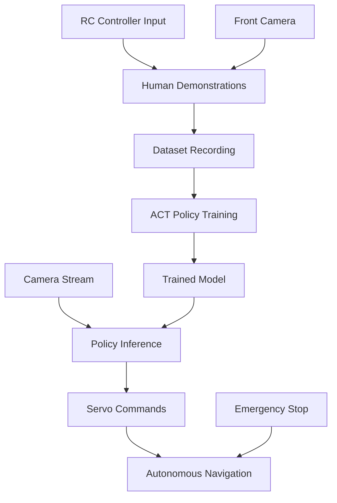

# QuantumTracer Imitation Learning

> **Autonomous RC Car Navigation using Vision-Based Imitation Learning**

This project implements autonomous navigation for the QuantumTracer RC car using imitation learning with the ACT (Action Chunking Transformer) policy, built on top of the LeRobot framework.

## 🎯 Project Overview

The QuantumTracer imitation learning system enables autonomous RC car navigation by:

1. **Recording** human driving demonstrations via RC controller
2. **Training** an ACT policy on vision + control data
3. **Deploying** the trained model for autonomous navigation

### Key Features

- ✅ **Vision-based navigation** using front-facing camera
- ✅ **Servo control** for steering and throttle
- ✅ **Real-time inference** optimized for edge deployment
- ✅ **Safety mechanisms** with emergency stop capabilities
- ✅ **Modular architecture** extending LeRobot's robust infrastructure

## 📁 Project Structure

```
QuantumTracer/src/imitation_learning/
├── README.md                          # This file
├── setup_lerobot.py                   # Environment setup script
├── tracer_pipeline.py                 # Main pipeline orchestrator
├── test_tracer_integration.py         # Integration tests
├── requirements_tracer.txt            # Additional dependencies
│
├── config/                            # Configuration files
│   ├── env/tracer_real.yaml          # Environment configuration
│   ├── policy/act_tracer.yaml        # ACT policy parameters
│   └── train/tracer_act.yaml         # Training hyperparameters
│
├── lerobot/                           # LeRobot framework (cloned)
│   └── src/lerobot/robots/tracer/     # Our Tracer robot implementation
│       ├── __init__.py
│       ├── config_tracer.py          # Robot configuration class
│       └── tracer.py                 # Main robot interface
│
├── docs/                              # Documentation and guides
│   ├── Imitation_Learning_Approach.md
│   ├── rc_car_integration_guide.md
│   └── rc_car_inference_strategy.md
│
└── outputs/                           # Generated during training/inference
    ├── datasets/                      # Recorded demonstrations
    ├── models/                        # Trained model checkpoints
    └── logs/                          # Training and evaluation logs
```

## 🚀 Quick Start

### Prerequisites

- **Hardware**: Tracer RC car with Raspberry Pi 4+
- **Software**: Python 3.8+, CUDA-capable GPU (optional, for training)
- **Dependencies**: See requirements_tracer.txt

### 1. Environment Setup

```bash
# Clone and setup the environment
git clone <repository_url>
cd QuantumTracer/src/imitation_learning

# Create conda environment (recommended)
conda create -n lerobot python=3.10
conda activate lerobot

# Install LeRobot dependencies
cd lerobot && pip install -e .

# Install Tracer-specific dependencies
cd .. && pip install -r requirements_tracer.txt

# Verify setup
python setup_lerobot.py
```

### 2. Complete Pipeline (One Command)

```bash
# Run the complete pipeline: record → train → deploy
python tracer_pipeline.py --step all --num-episodes 20
```

### 3. Step-by-Step Workflow

#### Step 1: Record Demonstrations
```bash
# Record human driving demonstrations
python tracer_pipeline.py --step record --num-episodes 20
# Creates: ./outputs/datasets/tracer_demos/
```

#### Step 2: Train ACT Policy
```bash
# Train the ACT policy on recorded data
python tracer_pipeline.py --step train \
    --dataset-path ./outputs/datasets/tracer_demos
# Creates: ./outputs/models/tracer_act/
```

#### Step 3: Deploy for Inference
```bash
# Run autonomous navigation
python tracer_pipeline.py --step deploy \
    --model-path ./outputs/models/tracer_act/checkpoints/last.ckpt
```

## 🏗️ Architecture & Strategy

### Technical Architecture



### Integration Strategy

Our approach **extends** rather than replaces LeRobot's architecture:

1. **Robot Implementation** (`lerobot/robots/tracer/`)
   - Custom `Tracer` robot class following LeRobot patterns
   - Servo control interface for steering/throttle
   - Camera integration for vision input

2. **Configuration System** (`config/`)
   - Environment, policy, and training configurations
   - YAML-based parameter management
   - Easy hyperparameter tuning

3. **Pipeline Orchestration** (`tracer_pipeline.py`)
   - Unified interface for record/train/deploy workflow
   - Error handling and logging
   - Progress monitoring

### Key Design Decisions

| Component | Choice | Rationale |
|-----------|--------|-----------|
| **Policy** | ACT (Action Chunking Transformer) | Excellent for continuous control, handles temporal dependencies |
| **Vision** | Single front camera (640x480@30fps) | Balance between information and compute requirements |
| **Control** | Direct servo PWM commands | Low latency, precise control |
| **Framework** | LeRobot extension | Leverages robust infrastructure, maintains compatibility |

## 📊 Performance & Specifications

### System Requirements

| Component | Minimum | Recommended |
|-----------|---------|-------------|
| **Training** | GTX 1060, 8GB RAM | RTX 3080+, 32GB RAM |
| **Inference** | Raspberry Pi 4B | Jetson Nano/Xavier |
| **Storage** | 10GB free space | 50GB+ SSD |

### Performance Metrics

- **Inference Latency**: <50ms per action (Raspberry Pi 4)
- **Training Time**: ~2 hours (20 episodes, RTX 3080)
- **Model Size**: ~45MB (ACT policy checkpoint)
- **Data Efficiency**: Good performance with 10-20 episodes

## 🔧 Configuration

### Key Configuration Files

#### Environment Config (`config/env/tracer_real.yaml`)
```yaml
robot:
  _target_: lerobot.robots.tracer.Tracer
  steering_pin: 18          # GPIO pin for steering servo
  throttle_pin: 19          # GPIO pin for throttle servo
  cameras:
    front:
      device_id: "/dev/video0"
      fps: 30
      resolution: [640, 480]
```

#### Policy Config (`config/policy/act_tracer.yaml`)
```yaml
_target_: lerobot.policies.act.ACTConfig
chunk_size: 32              # Action sequence length
hidden_size: 512           # Model capacity
n_cameras: 1               # Single front camera
```

#### Training Config (`config/train/tracer_act.yaml`)
```yaml
batch_size: 8              # Adjust based on GPU memory
steps: 50000              # Training iterations
eval_freq: 10000          # Evaluation frequency
```

## 🛠️ Development & Testing

### Running Tests
```bash
# Test robot integration
python test_tracer_integration.py

# Test individual components
python -m pytest tests/ -v
```

### Development Workflow
```bash
# 1. Make changes to robot implementation
vim lerobot/src/lerobot/robots/tracer/tracer.py

# 2. Test changes
python test_tracer_integration.py

# 3. Record small dataset for testing
python tracer_pipeline.py --step record --num-episodes 3

# 4. Quick training test
python tracer_pipeline.py --step train --quick-test
```

### Debugging Common Issues

| Issue | Solution |
|-------|----------|
| **Camera not found** | Check `/dev/video*` devices, ensure proper permissions |
| **Servo not responding** | Verify GPIO pins, check PWM setup |
| **Model not converging** | Increase dataset size, tune learning rate |
| **Inference too slow** | Enable model optimization, reduce input resolution |

## 📈 Advanced Usage

### Custom Training Parameters
```bash
python tracer_pipeline.py --step train \
    --config-override "batch_size=16,learning_rate=1e-4"
```

### Multi-Environment Training
```bash
# Train on multiple environments
python tracer_pipeline.py --step train \
    --dataset-path "./datasets/indoor,./datasets/outdoor"
```

### Model Optimization for Edge
```bash
# Convert to optimized format
python scripts/optimize_model.py \
    --checkpoint ./outputs/models/tracer_act/last.ckpt \
    --output ./deploy/tracer_optimized.onnx
```

## 🚨 Safety & Limitations

### Safety Features
- ✅ Emergency stop via GPIO pin
- ✅ Steering/throttle limits in configuration
- ✅ Automatic timeout and failsafe modes
- ✅ Real-time monitoring and logging

### Current Limitations
- 🔄 Single camera (no stereo depth)
- 🔄 Limited to structured environments
- 🔄 Requires good lighting conditions
- 🔄 No dynamic obstacle avoidance

### Future Enhancements
- 🎯 Multi-camera setup for better perception
- 🎯 LiDAR integration for obstacle detection
- 🎯 Online learning and adaptation
- 🎯 Fleet coordination capabilities

## 📚 Documentation

- **[Integration Guide](docs/rc_car_integration_guide.md)**: Detailed technical integration
- **[Inference Strategy](docs/rc_car_inference_strategy.md)**: Deployment options  
- **[Learning Approach](docs/Imitation_Learning_Approach.md)**: ML methodology

## 🤝 Contributing

1. Fork the repository
2. Create a feature branch (`git checkout -b feature/awesome-feature`)
3. Test your changes (`python test_tracer_integration.py`)
4. Commit your changes (`git commit -am 'Add awesome feature'`)
5. Push to the branch (`git push origin feature/awesome-feature`)
6. Open a Pull Request

## 📄 License

This project extends the LeRobot framework and follows their licensing terms. See [LICENSE](lerobot/LICENSE) for details.

## 🙏 Acknowledgments

- **[LeRobot Team](https://github.com/huggingface/lerobot)**: Robust robotics framework
- **[ACT Paper](https://arxiv.org/abs/2304.13705)**: Action Chunking Transformer methodology
- **[HuggingFace](https://huggingface.co)**: ML infrastructure and model hosting

---

**Built with ❤️ for autonomous robotics**

For questions, issues, or contributions, please open an issue or contact the development team.